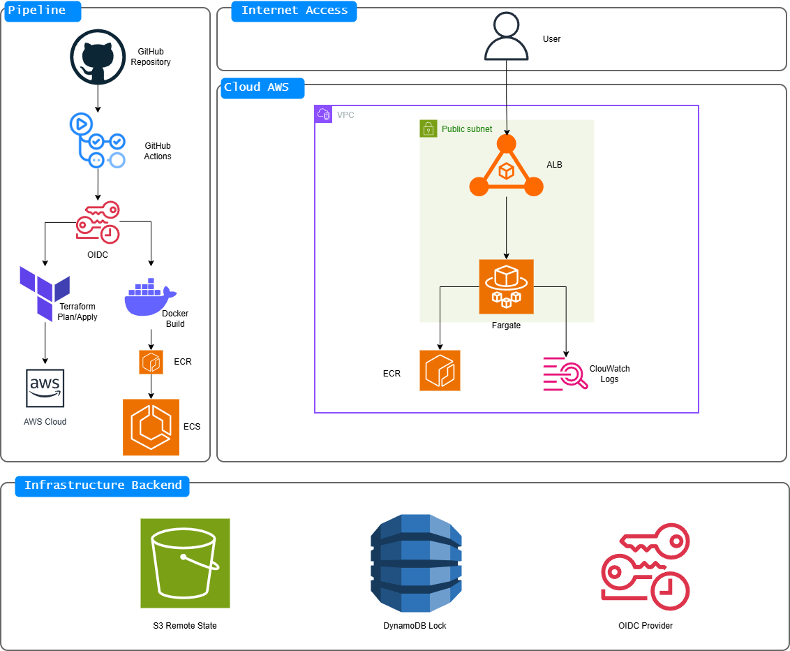

# DevopsProjectGiancarlo: Uma Jornada Completa em DevOps na AWS

## Visão Geral do Projeto

Este projeto é uma demonstração prática e abrangente de como construir, implantar e gerenciar uma aplicação web na AWS utilizando as melhores práticas de DevOps. Ele foi desenvolvido com o objetivo de solidificar conhecimentos em **IaC** com Terraform, **Pipelines CI/CD** com GitHub Actions, **Containerização** com Docker e **Serviços AWS** essenciais para a entrega contínua de software.

## Stack Utilizada

- AWS (ECS Fargate, ALB, ECR, S3, DynamoDB, IAM)
- Terraform (IaC modularizado)
- GitHub Actions (CI/CD com OIDC)
- Docker
- Node.js (Express)

## Diagrama

## Funcionalidades Chave

### 1. Infraestrutura como Código (IaC) com Terraform

Todo o ambiente AWS é provisionado e gerenciado via Terraform, garantindo **reprodutibilidade**, **consistência** e **rastreabilidade** das mudanças. A estrutura do Terraform é modular e organizada.

*   **Modularização Avançada:** A infraestrutura é dividida em módulos reutilizáveis (`network`, `security`, `alb`, `ecr`, `ecs`, `iam`). Isso não só facilita a manutenção e a compreensão do código, mas também permite a reutilização desses componentes em outros projetos e/ou ambientes.
*   **Gerenciamento de Múltiplos Ambientes:** Separação clara entre ambientes de `dev` e `prod` utilizando diretórios dedicados e arquivos `terraform.tfvars` específicos.
*   **Foundation para Recursos Essenciais:** Uma camada `foundation` separada para recursos de *bootstrapping* como o S3 para *remote state* , DynamoDB para *state locking* e Provider para utilização de *OIDC* pelo GitHub Actions. Essa abordagem é crucial para garantir a **segurança** e a **integridade** do estado do Terraform, evitando corrupção e conflitos em equipes.
*   **Remote State Seguro:** O estado do Terraform é armazenado em um bucket S3 configurado com **versionamento**, **criptografia (SSE-AES256)** e **bloqueio de acesso público**. O uso de DynamoDB para *state locking* previne que múltiplos *applies* ocorram simultaneamente, garantindo a **consistência** do estado.

### 2. Pipeline CI/CD Robusto com GitHub Actions

O pipeline de Integração Contínua e Entrega Contínua (CI/CD) automatiza o processo de build, teste e deploy da aplicação, garantindo entregas rápidas e confiáveis.

*   **Autenticação OIDC (OpenID Connect) na AWS:** Um dos pontos mais fortes do projeto. O pipeline utiliza OIDC para autenticar-se na AWS, eliminando a necessidade de armazenar chaves de acesso estáticas no GitHub. Isso é uma **prática de segurança de alto nível** que demonstra um conhecimento aprofundado em **DevSecOps** e gerenciamento de credenciais.
*   **Fluxo de `terraform plan` e `apply`:** O pipeline executa `terraform plan` em Pull Requests, permitindo a revisão das mudanças propostas na infraestrutura antes do *merge*. Após o *merge* para as branches `dev` ou `main`, o `terraform apply` é executado, utilizando o plano previamente validado, garantindo que **o que foi revisado é o que será implantado**.
*   **Build e Push de Imagens Docker:** A aplicação Node.js é containerizada com Docker, construída e enviada para o Amazon ECR. As imagens são *taggeadas* com o SHA do commit e o ambiente (`prod`/`dev`), garantindo **rastreabilidade** e facilidade de **rollbacks**
*   **Deploy Inteligente no ECS Fargate:** O pipeline atualiza a *Task Definition* do ECS de forma dinâmica, injetando a nova imagem Docker. Mais importante, ele **aguarda a estabilização do serviço (`wait-for-service-stability`)** após o deploy, garantindo que a nova versão da aplicação esteja saudável antes de finalizar o pipeline. Isso é crucial para **deploys sem downtime** e **detecção precoce de falhas**.
*   **Scan de Vulnerabilidades no ECR:** O ECR está configurado para realizar *scan* de vulnerabilidades nas imagens Docker no momento do *push*, adicionando uma camada essencial de **segurança** ao processo de build.

### 3. Arquitetura de Aplicação e Serviços AWS

*   **Aplicação Node.js com Express:** Uma aplicação backend simples em Node.js com Express, expondo uma rota principal e um *health check* (`/health`). Isso permite focar na infraestrutura e no pipeline, mas demonstra a integração completa com uma aplicação real.
*   **Amazon ECS Fargate:** A aplicação é executada em um cluster ECS Fargate, uma escolha **serverless** que elimina a necessidade de gerenciar servidores EC2, focando na **operação de containers**.
*   **Application Load Balancer (ALB):** Distribui o tráfego de entrada para as *tasks* do ECS, oferecendo **alta disponibilidade** e **escalabilidade**. O *health check* configurado no ALB garante que apenas *tasks* saudáveis recebam tráfego.
*   **Amazon ECR:** Repositório de imagens Docker totalmente gerenciado, integrado ao pipeline CI/CD.
*   **VPC Customizada:** Uma Virtual Private Cloud (VPC) com subnets públicas e Internet Gateway, fornecendo a base de rede para todos os recursos.

##  Decisões de Arquitetura e Trade-offs (Perspectiva Arquitetural)

Ao projetar este ambiente, diversas decisões foram tomadas, balanceando segurança, custo e complexidade:

*   **Subnets Públicas para ECS Fargate:** Para este projeto de portfólio, optei por alocar as *tasks* do ECS Fargate em subnets públicas. Embora em um ambiente de produção corporativo a prática recomendada seja utilizar subnets privadas (com NAT Gateway para saída de internet) para maior segurança, esta escolha foi feita para **otimizar custos** no contexto de um projeto de estudo, evitando o custo mensal de um NAT Gateway. Esta é uma decisão consciente e um trade-off que seria reavaliado em um cenário de produção.
*   **OIDC para Credenciais:** A escolha do OIDC em detrimento de chaves de acesso estáticas é uma decisão de segurança fundamental. Ela **reduz drasticamente a superfície de ataque** e está alinhada com as **melhores práticas de gerenciamento de identidade e acesso** em ambientes de CI/CD.
*   **Modularização do Terraform:** A decisão de modularizar o Terraform desde o início visa a **reusabilidade**, **manutenibilidade** e a **facilidade de colaboração** em projetos maiores. Cada módulo encapsula um conjunto de recursos relacionados, tornando o código mais legível e testável.

## Como Rodar o Projeto

Para replicar este ambiente, você precisará de:
1.  Uma conta AWS configurada.
2.  Credenciais AWS configuradas localmente (para `terraform init` inicial).
3.  Terraform CLI instalado.
4.  Docker instalado.
5.  GitHub CLI (opcional, para interagir com o repositório).

**Passos:**
1.  Clone este repositório.
2.  Navegue até `infra/terraform/foundation` e execute `terraform init && terraform apply` para provisionar o S3 Backend, DynamoDB Lock e a IAM Role para o GitHub Actions.
3.  Configure o segredo `ROLE_TO_ASSUME` no seu repositório GitHub (Settings -> Secrets and variables -> Actions) com o arn do provider OIDC. Configure também variáveis TF_ENV, uma prod, e outra dev (ou o nome de suas branch), e uma variável de repositório chamada AWS_REGION com sua região (recomendo a us-east-1)
4.  Faça um *push* para a branch `dev` ou `main` para acionar o pipeline CI/CD e implantar a infraestrutura e a aplicação.

## Próximos Passos e Melhorias Contínuas

Um projeto DevOps nunca está "terminado". Aqui estão algumas ideias para o futuro:

*   **HTTPS no ALB:** Configurar um certificado SSL/TLS via AWS Certificate Manager (ACM) e habilitar HTTPS no ALB para tráfego seguro.
*   **Testes Automatizados:** Adicionar etapas de testes unitários e de integração no pipeline CI/CD para a aplicação Node.js.
*   **Análise de Código Estática:** Integrar ferramentas como `tfsec` ou `Checkov` para análise de segurança do código Terraform e `ESLint` para o código Node.js.
*   **Frontend:** Desenvolver e integrar uma aplicação frontend (ex: React/Angular/Vue) e implantá-la no S3 com Route53 e CDN.

Sou desenvolvedor focado em DevOps e Cloud, com interesse em construir pipelines confiáveis, infraestrutura escalável e práticas modernas de segurança.

Aberto a oportunidades e feedbacks!

Este projeto é um ponto para eu demonstrar algumas habilidades minhas em DevOps. Sinta-se à vontade para olhar, criticar, complementar ou elogiar!

Giancarlo Schulze Pessatti
